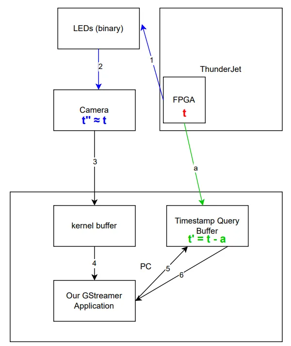
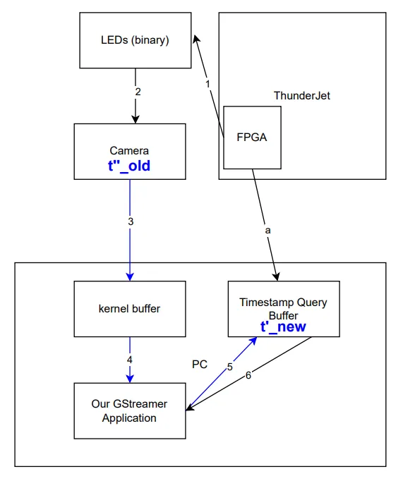

# Camera Latency

We conducted experiments to evaluate the latency in our camera system. Our results indicate that most timestamp discrepancies fall within approximately \(5.314\, \text{ms}\). This is well within the frame duration of cameras operating below \(188\, \text{fps}\) (roughly \(5.32\, \text{ms}\) per frame), ensuring that neural data remains correctly aligned with the corresponding video frame even if a slight latency error occurs.

## Methodology

The system's total latency is measured from the FPGA to the Timestamp Query Buffer. The diagrams below illustrate the propagation pipeline and the step-by-step calculation:

### Latency Calculation Steps

1. **Neglecting Initial Delays:**  
   We assume that the delays in the initial stages (steps 1 and 2 in the pipeline) are negligible. Therefore, we approximate:
   $$
   t'' \approx t
   $$

2. **Adjusting for Offset:**  
   The query buffer timestamp is offset by a delay \(a\). In other words:
   $$
   t' = t - a
   $$

3. **Measurement Process:**  
   - **Timestamp Difference:** Measure the difference between the new query buffer timestamp and the old FPGA LED timestamp:

$$
\Delta t = t^{\prime}_{\text{new}} - t^{\prime\prime}_{\text{old}}
$$

   - **Roundtrip Delay:** Independently, determine the roundtrip delay, which corresponds to \(2a\).
$$
\text{Roundtrip Delay} = 2a
$$

1. **Total Latency Calculation:**  
   The combined latency can then be expressed as:
$$
Latency = \Delta t + a
$$

The second diagram provides further details on these steps:

## Experiment Setup

- **High-Speed Camera:**  
  Operates at \(596\, \text{fps}\), which allows us to sample the LED signal at \(596\, \text{Hz}\).

- **LEDs:**  
  Used to indicate the FPGA timestamp.

- **ThorVision Software Stack:**  
  Employed for recording video frames and saving the corresponding XDAQ timestamp in each frame.

## Results

- **Measured Timestamp Difference (\(t'_{\text{new}} - t''_{\text{old}}\)):**  
    - Upper Bound: \(5.12\, \text{ms}\)  
    - Average: \(2.94\, \text{ms}\)
  
- **Offset Value (\(a\)):**  
    - Maximum: \(a \leq 0.194\, \text{ms}\)
  
- **Calculated Latency:**  
    - Upper Bound:
    $$
    \text{Latency}_{\text{upper}} = 5.12\, \text{ms} + 0.194\, \text{ms} = 5.314\, \text{ms}
    $$
    - Average:
    $$
    \text{Latency}_{\text{avg}} = 2.94\, \text{ms} + 0.194\, \text{ms} = 3.134\, \text{ms}
    $$

## Conclusion

For optimal performance, it is recommended that your camera operates at or below \(188\, \text{fps}\). This ensures that the frame duration comfortably accommodates the measured latency margin, thereby maintaining reliable synchronization between video frames and neural data.