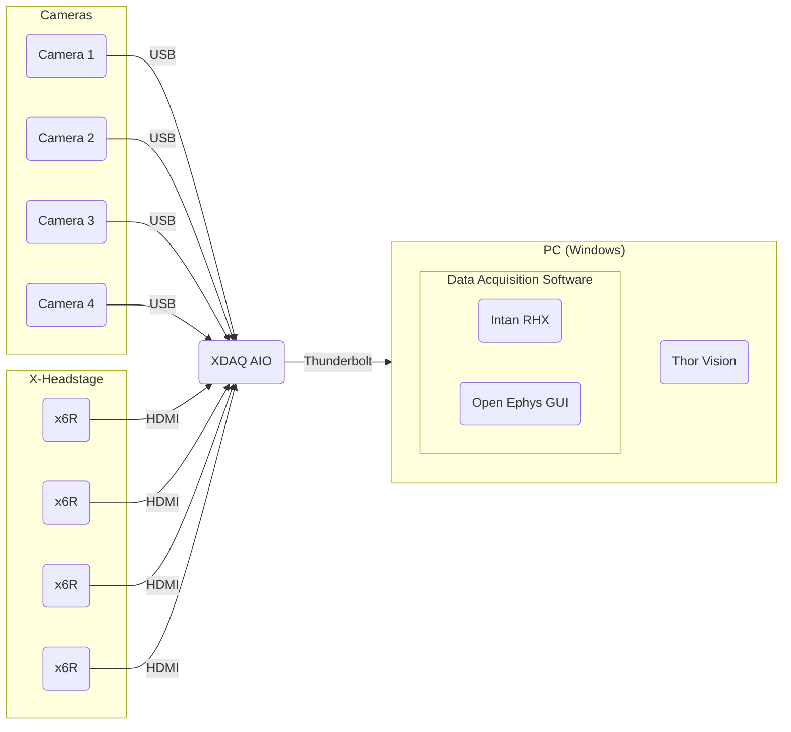
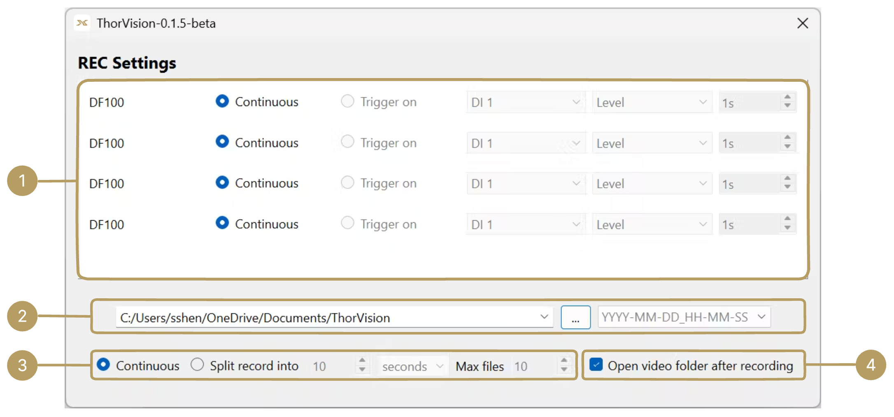
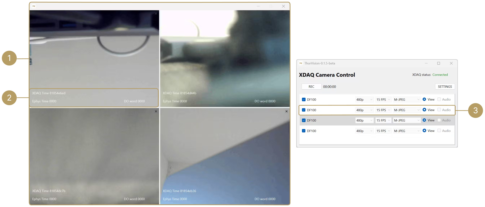
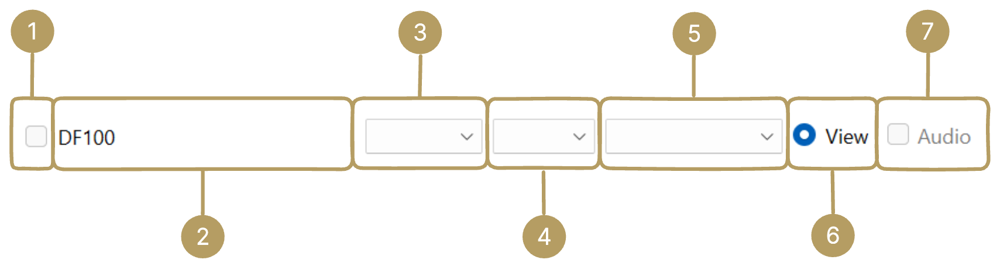

# User Manual

## Overview

Thor Vision is a GUI app designed for seamless control and video capture from USB cameras on the [XDAQ AIO](https://www.kontex.io/xdaq). This user manual provides instructions on how to use the features of the application effectively.

```mermaid
graph LR;
    subgraph PC["PC (Windows)"]
        TV(Thor Vision)
        subgraph DA[Data Acquisition Software]
            RHX(Intan RHX)
            OE(Open Ephys GUI)
        end
    end

    XDAQ(XDAQ AIO)

    subgraph CAMS[Cameras]
        CAM1(Camera 1)
        CAM2(Camera 2)
        CAM3(Camera 3)
        CAM4(Camera 4)
    end

    subgraph XH[X-Headstage]
        x6R1(x6R)
        x6R2(x6R)
        x6R3(x6R)
        x6R4(x6R)
    end

    XDAQ -->|Thunderbolt| PC;
    CAM1 -->|USB| XDAQ;
    CAM2 -->|USB| XDAQ;
    CAM3 -->|USB| XDAQ;
    CAM4 -->|USB| XDAQ;

    x6R1 -->|HDMI| XDAQ;
    x6R2 -->|HDMI| XDAQ;
    x6R3 -->|HDMI| XDAQ;
    x6R4 -->|HDMI| XDAQ;

    click XDAQ "https://www.kontex.io/xdaq" "Go to XDAQ page" _blank
    click RHX "https://intantech.com/RHX_software.html" "Go to Intan RHX page" _blank
    click OE "https://open-ephys.org/gui" "Go to Open Ephys GUI page" _blank
    click TV "https://github.com/kontex-neuro/ThorVision" "Go to Thor Vision page" _blank
```

---

## Hardware Requirements

- **PC**: with a Thunderbolt 3.0 port or higher.
- [**XDAQ AIO**](https://www.kontex.io/xdaq).
- **Thunderbolt 3.0 Cable** (or higher).
- [**USB Cameras**](usb-cameras.md): Compatible with XDAQ.

/// note | Coming soon
Support for Ubuntu is in development
///

---

## Installation

[:fontawesome-brands-windows:](https://github.com/kontex-neuro/ThorVision/releases/download/v0.1.4/ThorVision-0.1.4-win64.exe){ .icon-large } 
[:fontawesome-brands-apple:](){ .icon-large }
[:fontawesome-brands-ubuntu:](){ .icon-large } (coming soon)

---

## User Interface Overview

### 1. Record

Press to record streaming cameras with embedded XDAQ metadata. Recording requires at least one active camera stream. The recording file name follows the format: `<camera-name>-<device-id>-<start-record-time>`.

### 2. Camera List

View and control all cameras connected to the XDAQ AIO.

### 3. XDAQ Status

Show current XDAQ status.

### 4. [Record Settings](#record-settings)

Open the record settings window for advanced configuration options.

---

## Record Settings

### 1. Cameras Recording Settings

Choose either `Continuous` or `Trigger on` to record camera.

- **Continuous**: Start recording by pressing the `REC` button.
- **Trigger on**: Start recording from hardware TTL or via the [Brainwave simulator](https://www.kontex.io/product/Brainwave-Simulator).

/// note | Coming soon
`Trigger on` option is in development
///

### 2. Record Path/Folder Name

- **Record Path**: Click `...` to select the folder for saving recordings, or manually enter the directory path.
- **Folder Name**: Choose between:
  - **Auto** Automatically generated folder name in `YYYY-MM-DD_HH-MM-SS` format.
  - **Custom**: Specify a custom folder name.

/// note | Note
Default record directory:

- Windows: `C:/Users/<user_name>/Documents/ThorVision`
- macOS: `/Users/<user_name>/Documents/ThorVision`
- Ubuntu: coming soon.
///

### 3. Record Mode

Choose either `Continuous` or `Split record into` to record cameras.

- **Continuous**: Record a single, uninterrupted video file for the entire recording session.
- **Split record into**: Record multiple video files, each split into predefined segments (e.g., 5 seconds, 10 seconds).

---

## Camera Control

### 1. Stream Window

View live streams from cameras on the XDAQ AIO.

### 2. [XDAQ Metadata](xdaq-metadata.md)

Display live metadata from cameras on the XDAQ AIO.

### 3. Camera Control Options

#### 1. Start/Stop Stream

Start or Stop the live stream from the camera.

#### 2. Camera name

Double click to rename it. (Max. 30 characters)

#### 3. Resolution

Select a compatible resolution for the camera.

#### 4. FPS

Select a compatible frame rate (FPS) for the camera.

#### 5. Codec

Select a compatible codec for the camera.

/// tip | Tip
Each camera has its own unique capabilities. Dimmed options for resolution, FPS, and codec indicate that the currently selected camera does not support these settings. However, these options remain **clickable**, and selecting them will reset the camera's current settings.
///

#### 5. View

Toggle to show or hide the camera view.

#### 6. Audio

/// note | Coming soon
`Audio` option is in development
///

---

## Log files

The app records all user actions, and logs are flushed every 10 seconds.

Locate the log files:

- Windows: `C:\ProgramData\ThorVision\`
- macOS: `/Users/<user_name>/Library/Application Support/ThorVision/`
- Ubuntu: coming soon.
