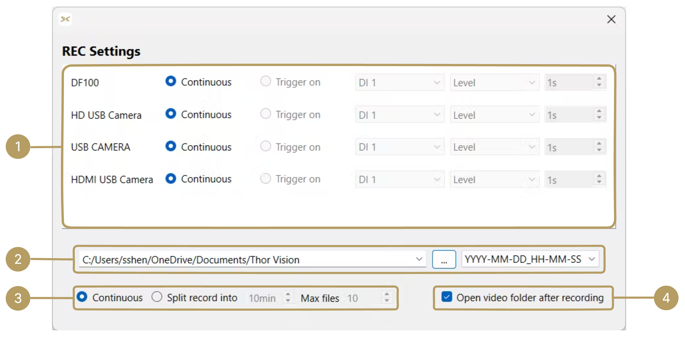

# User Manual

## Overview

Thor Vision is a GUI app designed for seamless control and video capture from USB cameras on the [XDAQ AIO](https://kontex.io/pages/xdaq). This user manual provides instructions on how to use the features of the application effectively.

---

## Hardware Requirements

* **PC**: Windows with a Thunderbolt 3.0 port or higher.
* [**XDAQ AIO**](https://kontex.io/pages/xdaq).
* **Thunderbolt 3.0 Cable** (or higher).
* [**USB Cameras**](usb-cameras.md): Compatible with XDAQ.

/// note | Note 
Support for macOS and Ubuntu is in development (coming soon)
///

---

## Installation

[:fontawesome-brands-windows:](https://github.com/kontex-neuro/ThorVision/releases/download/v0.0.1/XDAQ-VC-0.0.1-win64.exe){ .icon-large } 
[:fontawesome-brands-apple:](){ .icon-large } (coming soon) 
[:fontawesome-brands-ubuntu:](){ .icon-large } (coming soon)

---

## User Interface Overview

### 1. Record

Press the button to record videos with embedded [XDAQ metadata](xdaq-metadata.md).

### 2. Camera List

View and live stream cameras on the [XDAQ AIO](https://kontex.io/pages/xdaq).

### 3. Server status

Display current server status on the [XDAQ AIO](https://kontex.io/pages/xdaq).

### 4. Record Settings

Open the record settings window for advanced configuration options.

---

## Record Settings

### 1. Cameras Recording Settings

Choose either `Continuous` or `Trigger on` to record camera.

* **Continuous**: Start recording by pressing the `REC` button.
* **Trigger on**: Start recording from hardware TTL or via the [**Brainwave simulator**](https://kontex.io/products/brain-signal-simulator). 

/// note | Note 
`Trigger on` option is in development (coming soon)
///

### 2. Record Path/Folder Name

* **Record Path**: Click `...` to select the folder for saving recordings, or manually enter the directory path.
* **Folder Name**: Choose between:
    * **Auto** Automatically generated folder name in `YYYY-MM-DD_HH-MM-SS` format.
    * **Custom**: Specify a custom folder name.

### 3. Record Mode

Choose either `Continuous` or `Split record into` to record cameras.

* **Continuous**: Record a single, uninterrupted video file for the entire recording session.
* **Split record into**: Record multiple video files, each split into predefined segments (e.g., 5 seconds, 10 seconds).

<!-- ### 4. Extract Metadata

Enable this option to store [XDAQ metadata](metadata.md) in a separate file for post-processing. -->

---

## Camera Control

### 1. Stream Window

View live streams from cameras on the [XDAQ AIO](https://kontex.io/pages/xdaq).

### 2. [XDAQ Metadata](xdaq-metadata.md)

Display live metadata from cameras on the [XDAQ AIO](https://kontex.io/pages/xdaq).

### 3. Camera Control Options

#### 1. Start/Stop Stream

Start or Stop the live stream from the camera.

#### 2. Resolution

Select a compatible resolution for the camera.

#### 3. FPS

Select a compatible frame rate (FPS) for the camera.

#### 4. Codec

Select a compatible codec for the camera.

/// tip | Tip
Each camera has its own unique capabilities. Dimmed options for resolution, FPS, and codec indicate that the currently selected camera does not support these settings. However, these options remain **clickable**, and selecting them will reset the camera's current settings.
///

#### 5. View

Toggle to show or hide the camera view.

#### 6. Audio

/// note | Note 
`Audio` option is in development (coming soon)
///

---