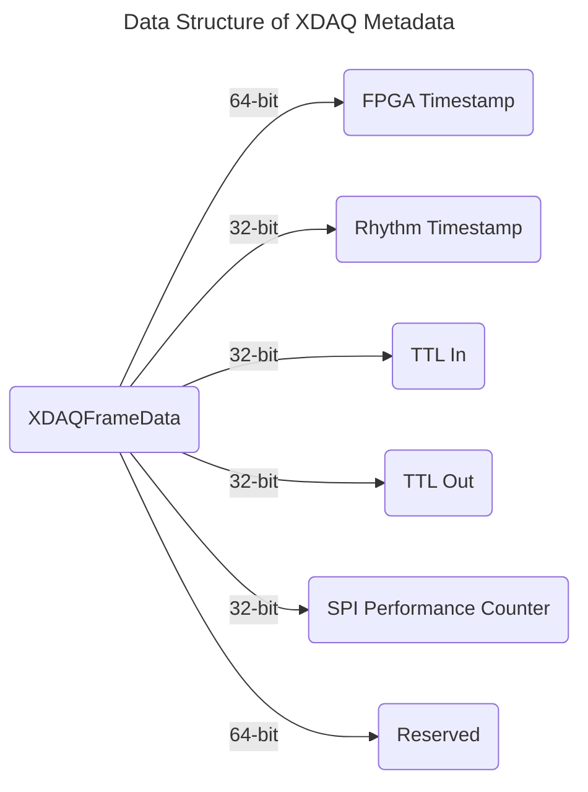

# XDAQ Metadata

XDAQ metadata is embedded into camera frames captured by [XDAQ AIO](https://kontex.io/pages/xdaq) and streamed live to a PC via Thunderbolt. Each recorded frame contains both the JPEG encoded image data and its associated XDAQ metadata.

/// note | Note 
Record H.265 encoded videos (coming soon)
///