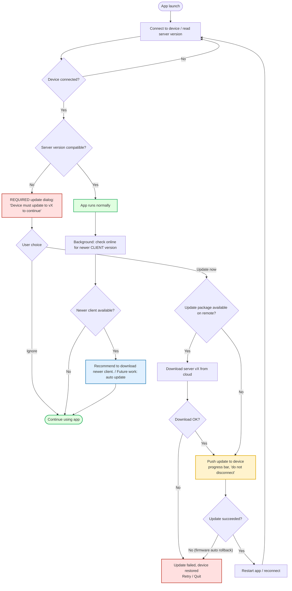

```mermaid
flowchart TD
    A([App launch]) --> B[Connect to device / read server version]
    B --> C{Device connected?}
    C -- No --> B
    C -- Yes --> D{Server version compatible?}

    D -- "No" --> E[REQUIRED update dialog:<br/>'Device must update to vX to continue']
    E --> F{User choice}
    F -- "Ignore" --> O
    F -- "Update now" --> G{Update package available on remote?}
    G -- "Yes" --> H[Download server vX from cloud]
    H --> H1{Download OK?}
    H1 -- No --> J1
    H1 -- Yes --> I
    G -- "No" --> I[Push update to device<br/>progress bar, 'do not disconnect']
    I --> J{Update succeeded?}
    J -- "No (firmware auto rollback)" --> J1[Update failed, device restored<br/>Retry / Quit]
    J -- Yes --> K[Restart app / reconnect] --> B

    D -- Yes --> L[App runs normally]
    L --> M[Background: check online for newer CLIENT version]
    M --> N{Newer client available?}
    N -- No --> O([Continue using app])
    N -- Yes --> P[Recommend to download newer client. / Future work: auto update] --> O

    classDef blocking fill:#ffe0e0,stroke:#c0392b,stroke-width:2px;
    classDef warn     fill:#fff3cd,stroke:#e0a800,stroke-width:2px;
    classDef notify   fill:#e0f0ff,stroke:#2980b9,stroke-width:2px;
    classDef ok       fill:#e0ffe0,stroke:#27ae60,stroke-width:2px;

    class E,H2,J1 blocking
    class I warn
    class P notify
    class L,O ok
```